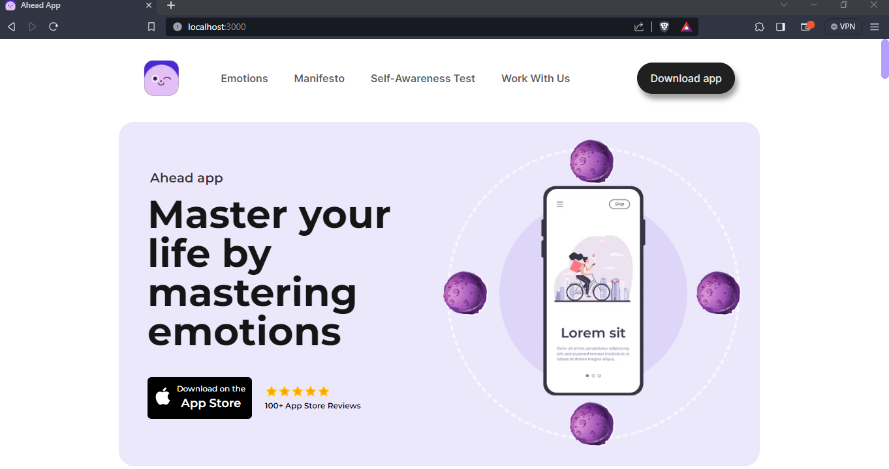
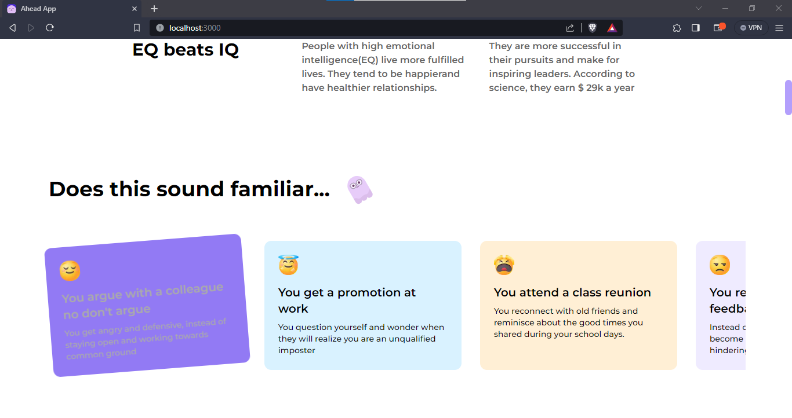
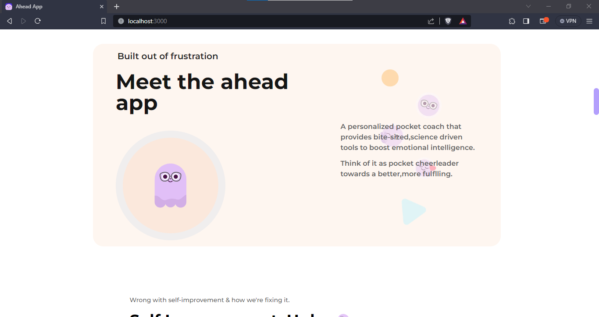
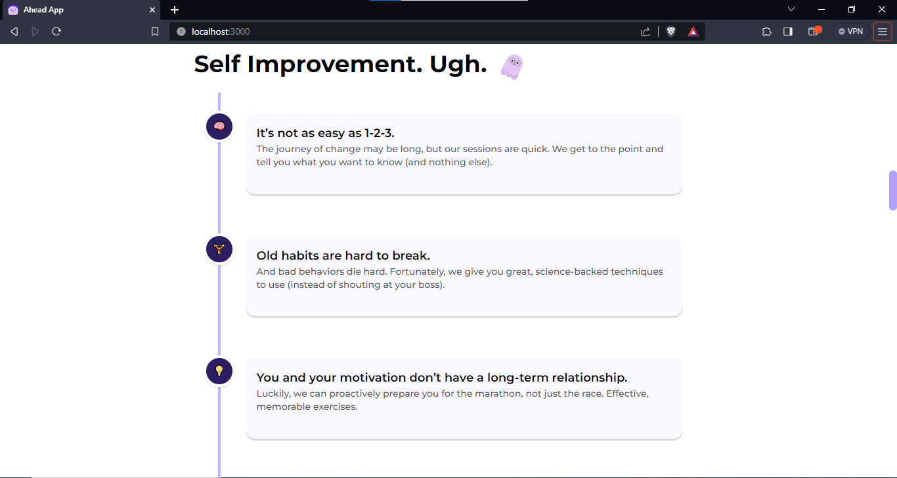
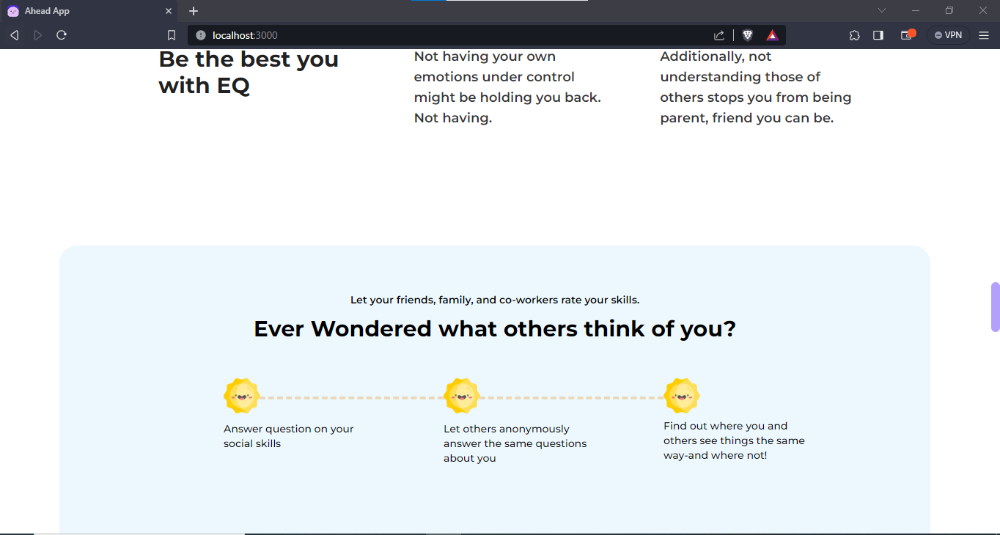
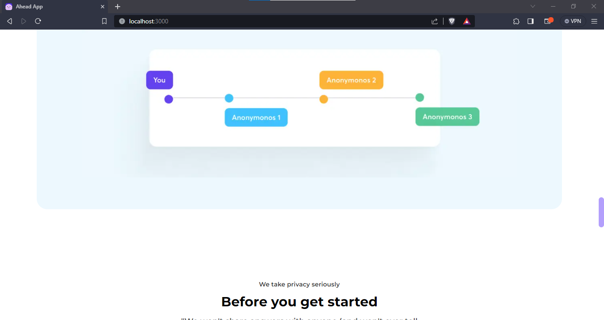
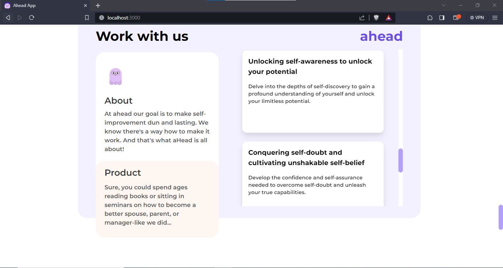
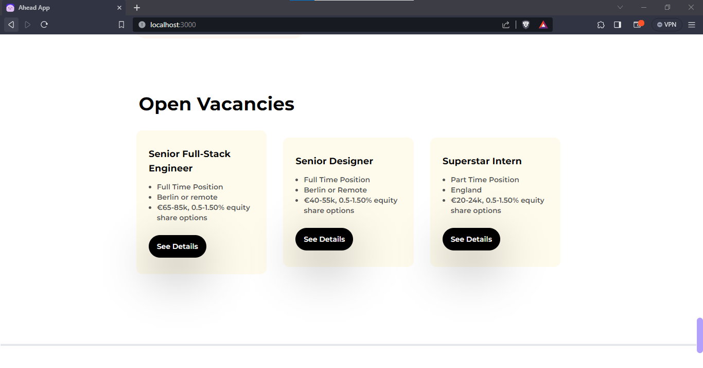
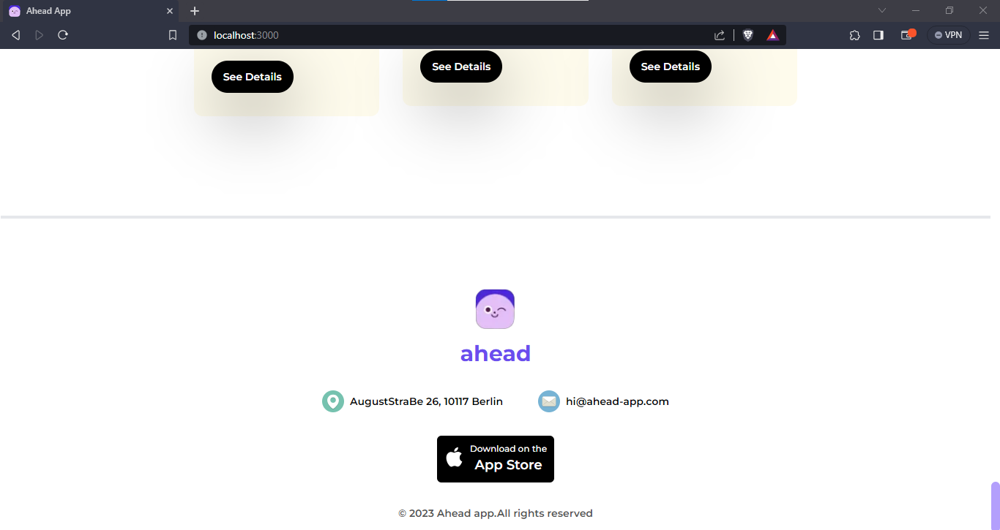

# AHEAD-APP-DENSITY.EXCHANGE

## Tech stack:

NextJS, tailwind/mui or any css library similar.

## Live Link

## Preview











## Deployment: Vercel

<br/>
<br/>

## Task

Develop this [nice webpage](https://dribbble.com/shots/19807069-Ahead-app-redesign-concept) with animation.

This is a [Next.js](https://nextjs.org/) project bootstrapped with [`create-next-app`](https://github.com/vercel/next.js/tree/canary/packages/create-next-app).

## Getting Started

First, run the development server:

```bash
npm run dev
# or
yarn dev
# or
pnpm dev
```

Open [http://localhost:3000](http://localhost:3000) with your browser to see the result.
You can start editing the page by modifying `app/page.js`. The page auto-updates as you edit the file.
